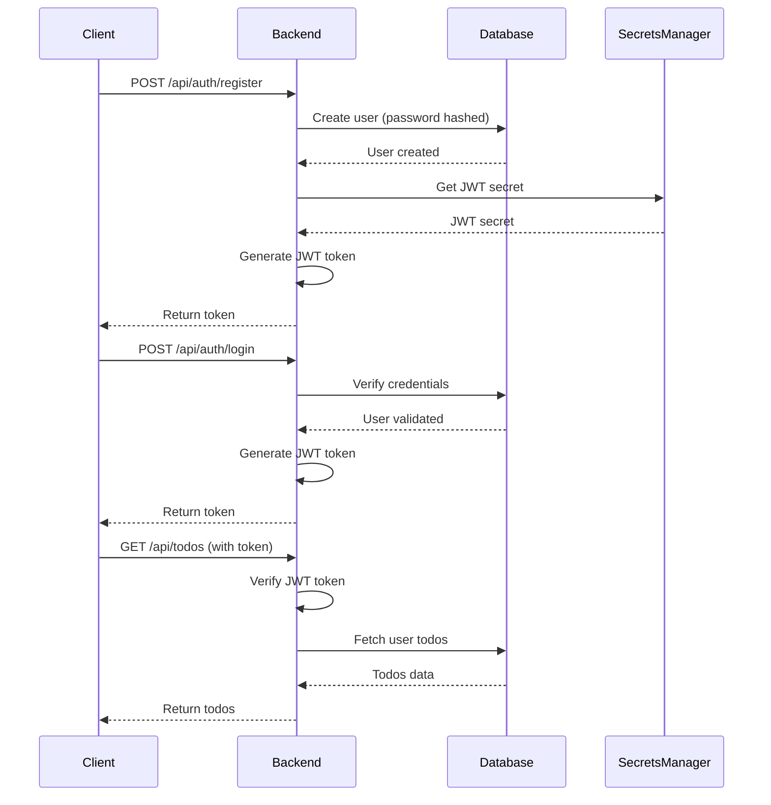

# Architecture Overview

The Golden Path follows a standardized architecture designed for scalability, maintainability, and production-readiness. This guide explains the core architectural patterns and design decisions.

## Architecture Principles

<CardGroup cols={2}>
  <Card title="Monorepo Structure" icon="folder">
    Clear separation of frontend, backend, and infrastructure in a single repository
  </Card>
  <Card title="AWS-Native" icon="aws">
    Designed to run seamlessly on AWS with minimal configuration
  </Card>
  <Card title="Security-First" icon="lock">
    Security built into every layer from authentication to monitoring
  </Card>
  <Card title="Observability-Built-In" icon="chart-line">
    Comprehensive monitoring with X-Ray, CloudWatch, and GuardDuty
  </Card>
</CardGroup>

## High-Level Architecture

```
┌─────────────────────────────────────────────────────────────┐
│                      User Browser                            │
│                    (React Frontend)                          │
└──────────────────────┬──────────────────────────────────────┘
                       │ HTTPS
                       ▼
┌─────────────────────────────────────────────────────────────┐
│                    CloudFront CDN                           │
│              (Static Asset Delivery)                         │
└──────────────────────┬──────────────────────────────────────┘
                       │
                       ▼
┌─────────────────────────────────────────────────────────────┐
│                  Application Load Balancer                   │
│                    (Route 53 DNS)                            │
└──────────────────────┬──────────────────────────────────────┘
                       │
        ┌──────────────┴──────────────┐
        │                             │
        ▼                             ▼
┌──────────────────┐        ┌──────────────────┐
│   Frontend       │        │    Backend        │
│   (S3 + CF)      │        │   (ECS Fargate)   │
│                  │        │                   │
│  React + Vite    │◄──────►│  Node.js + Express│
│  Ant Design      │  API   │  JWT Auth         │
│  Tailwind CSS    │        │  X-Ray Tracing    │
└──────────────────┘        └─────────┬─────────┘
                                      │
                        ┌─────────────┼─────────────┐
                        │             │             │
                        ▼             ▼             ▼
              ┌──────────────┐ ┌──────────┐ ┌──────────────┐
              │   Database   │ │ Secrets  │ │   X-Ray      │
              │  (RDS/Mongo) │ │ Manager  │ │   Daemon     │
              └──────────────┘ └──────────┘ └──────────────┘
```

## Component Architecture

### Frontend Architecture

```
frontend/
├── src/
│   ├── components/          # Reusable React components
│   │   ├── TodoList.jsx
│   │   ├── TodoForm.jsx
│   │   └── ThemeToggle.jsx
│   ├── context/            # React context providers
│   │   └── ThemeContext.jsx
│   ├── utils/              # Utility functions
│   │   └── api.js          # API client
│   ├── App.jsx             # Main app component
│   └── main.jsx            # Entry point
├── index.html
├── vite.config.js           # Vite configuration
└── tailwind.config.js       # Tailwind CSS config
```

**Key Features:**
- **Component-Based**: Modular, reusable React components
- **State Management**: React Context for global state
- **Styling**: Tailwind CSS with dark mode support
- **Build Tool**: Vite for fast development and optimized builds
- **UI Library**: Ant Design for consistent components

### Backend Architecture

```
backend/
├── src/
│   ├── config/              # Configuration files
│   │   ├── database.js      # Database connection
│   │   └── secrets-manager.js  # AWS Secrets Manager
│   ├── middleware/          # Express middleware
│   │   ├── auth.js          # JWT authentication
│   │   ├── errorHandler.js  # Error handling
│   │   └── rateLimiter.js   # Rate limiting
│   ├── models/              # Data models
│   │   ├── User.js          # User schema
│   │   └── Todo.js          # Todo schema
│   ├── routes/              # API routes
│   │   ├── auth.js          # Authentication routes
│   │   └── todos.js         # Todo CRUD routes
│   └── utils/               # Utility functions
│       └── jwt.js           # JWT utilities
├── server.js                # Main server file
└── package.json
```

**Key Features:**
- **RESTful API**: Standard HTTP methods and status codes
- **Authentication**: JWT-based with refresh tokens
- **Security**: Rate limiting, CORS, input validation
- **Error Handling**: Centralized error handling middleware
- **Observability**: X-Ray integration for distributed tracing

### Database Architecture

<AccordionGroup>
<Accordion title="MongoDB Schema (fullstack-todo template)">
```javascript
Users Collection
├── _id (ObjectId)
├── username (String, unique, indexed)
├── email (String, unique, indexed)
├── password (String, hashed with bcrypt)
├── firstName, lastName (String)
├── preferences (Object)
│   ├── theme (String)
│   └── notifications (Object)
├── statistics (Object)
│   ├── todosCreated (Number)
│   └── todosCompleted (Number)
└── timestamps

Todos Collection
├── _id (ObjectId)
├── user (ObjectId, ref: User, indexed)
├── title (String)
├── description (String)
├── completed (Boolean, indexed)
├── priority (String: low|medium|high|urgent)
├── dueDate (Date, indexed)
├── tags (Array, indexed)
├── category (String)
├── status (String)
├── subtasks (Array)
└── timestamps
```
</Accordion>

<Accordion title="PostgreSQL Schema (alternative)">
```sql
users
├── id (UUID, primary key)
├── username (VARCHAR, unique)
├── email (VARCHAR, unique)
├── password_hash (VARCHAR)
├── created_at (TIMESTAMP)
└── updated_at (TIMESTAMP)

todos
├── id (UUID, primary key)
├── user_id (UUID, foreign key → users.id)
├── title (VARCHAR)
├── description (TEXT)
├── completed (BOOLEAN)
├── created_at (TIMESTAMP)
└── updated_at (TIMESTAMP)

-- Indexes
CREATE INDEX idx_todos_user_id ON todos(user_id);
CREATE INDEX idx_todos_completed ON todos(completed);
```
</Accordion>
</AccordionGroup>

## Infrastructure Architecture

### AWS Services Used

<CardGroup cols={3}>
  <Card title="Compute" icon="server">
    **ECS Fargate**<br/>
    Container orchestration without managing servers
  </Card>
  <Card title="Database" icon="database">
    **RDS / MongoDB Atlas**<br/>
    Managed databases with automated backups
  </Card>
  <Card title="Storage" icon="hard-drive">
    **S3 + CloudFront**<br/>
    Static assets with global CDN
  </Card>
  <Card title="CI/CD" icon="arrows-rotate">
    **CodePipeline + CodeBuild**<br/>
    Automated build and deployment
  </Card>
  <Card title="Secrets" icon="lock">
    **Secrets Manager**<br/>
    Secure credential storage
  </Card>
  <Card title="Monitoring" icon="chart-line">
    **X-Ray + CloudWatch**<br/>
    Distributed tracing and metrics
  </Card>
</CardGroup>

### Deployment Architecture

```
GitHub Repository
       │
       │ (Push event)
       ▼
┌──────────────────────────────────┐
│      AWS CodePipeline              │
│                                    │
│  ┌──────────┐    ┌──────────┐     │
│  │  Source  │───►│  Build   │     │
│  │  (GitHub)│    │(CodeBuild)│    │
│  └──────────┘    └────┬─────┘     │
│                        │            │
│                 ┌──────▼──────┐    │
│                 │    Test     │    │
│                 │  (QA Wolf)  │    │
│                 └──────┬──────┘    │
│                        │            │
│                 ┌──────▼──────┐    │
│                 │   Deploy    │    │
│                 │   (ECS)     │    │
│                 └─────────────┘    │
└────────────────────────────────────┘
```

## Security Architecture

### Authentication Flow



### Security Layers

<Steps>
  <Step title="Network Security">
    - HTTPS/TLS for all communications
    - VPC isolation for AWS resources
    - Security groups with least privilege access
    - WAF rules for common attacks
  </Step>
  <Step title="Application Security">
    - JWT authentication with secure tokens
    - Rate limiting to prevent abuse
    - Input validation and sanitization
    - CORS policies configured
  </Step>
  <Step title="Data Security">
    - Passwords hashed with bcrypt
    - Secrets stored in AWS Secrets Manager
    - Database encryption at rest
    - Encrypted connections (TLS)
  </Step>
  <Step title="Monitoring & Detection">
    - X-Ray for request tracing
    - GuardDuty for threat detection
    - CloudWatch for anomaly detection
    - Automated alerting
  </Step>
</Steps>

## Observability Architecture

### Distributed Tracing

```
User Request
    │
    ├─► Frontend (CloudFront)
    │       │
    │       └─► Backend (ECS)
    │               │
    │               ├─► Database Query
    │               │       └─► X-Ray Subsegment
    │               │
    │               └─► Secrets Manager
    │                       └─► X-Ray Subsegment
    │
    └─► Complete Trace in X-Ray Console
```

### Monitoring Stack

- **X-Ray**: Distributed tracing across services
- **CloudWatch**: Logs, metrics, and alarms
- **GuardDuty**: Threat detection and security monitoring
- **CodeRabbit**: Automated code security scanning

## Scalability Design

### Horizontal Scaling

- **Frontend**: Stateless, can scale behind CloudFront
- **Backend**: Stateless API, scales with ECS Fargate
- **Database**: Read replicas for read-heavy workloads

### Performance Optimizations

- **Caching**: CloudFront edge caching for static assets
- **CDN**: Global content delivery for low latency
- **Database Indexes**: Optimized queries with proper indexes
- **Connection Pooling**: Efficient database connections
- **Compression**: Gzip compression for API responses

## Development Workflow

```
┌─────────────┐
│  Developer  │
└──────┬──────┘
       │
       │ git push
       ▼
┌──────────────────┐
│  GitHub Repo     │
└──────┬───────────┘
       │
       │ (webhook)
       ▼
┌──────────────────┐      ┌──────────────┐
│  CodePipeline    │─────►│  CodeRabbit  │
│                  │      │  (Auto Review)│
└──────┬───────────┘      └──────────────┘
       │
       ├─► Build (CodeBuild)
       ├─► Test (QA Wolf)
       └─► Deploy (ECS)
```

## Best Practices

<CardGroup cols={2}>
  <Card title="Code Quality">
    - TypeScript for type safety
    - ESLint + Prettier for consistency
    - CodeRabbit for automated reviews
    - Comprehensive test coverage
  </Card>
  <Card title="DevOps">
    - Infrastructure as Code
    - Automated deployments
    - Environment parity
    - Blue-green deployments
  </Card>
  <Card title="Security">
    - Least privilege IAM roles
    - Secrets in Secrets Manager
    - Regular security audits
    - Dependency vulnerability scanning
  </Card>
  <Card title="Monitoring">
    - Distributed tracing
    - Structured logging
    - Performance metrics
    - Automated alerting
  </Card>
</CardGroup>

## Next Steps

- Learn about [specific templates](/templates/fullstack-todo)
- Set up [AWS services](/aws/secrets-manager)
- Configure [integrations](/integrations/backstage)
- Read the [deployment guide](/development/deployment)

